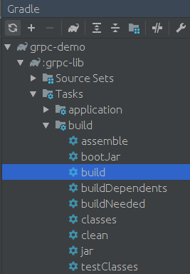

# grpc-demo

server 和 client 都依赖grpc-lib

grpc使用0.18.0版本(0.21.0和0.18.0不太兼容)

grpc-lib生成过程:



点击build生成目录

idea生成的文件有问题,所以使用protoc重新生成

```bash
$ pwd
$ /home/lurenjia/gopath/src/github.com/lurenjia528/grpc-demo
$ protoc --java_out=./grpc-lib/src/generated/main/java/ ./grpc-lib/src/main/proto/helloworld.proto
```

启动server

启动client

访问 http://127.0.0.1:8080/